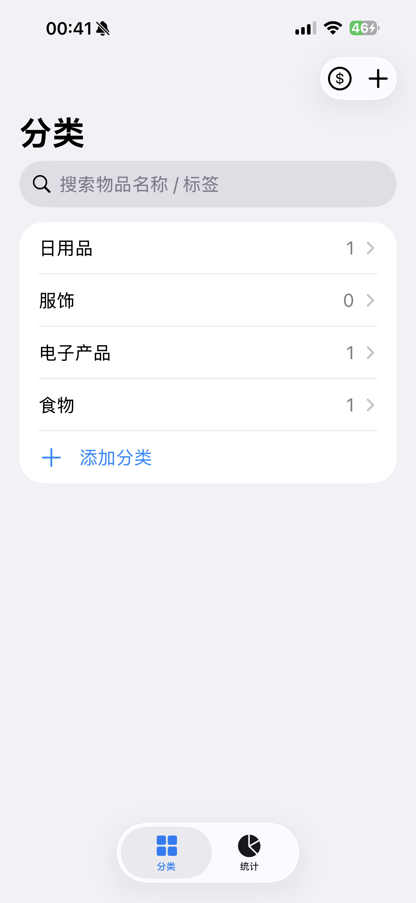
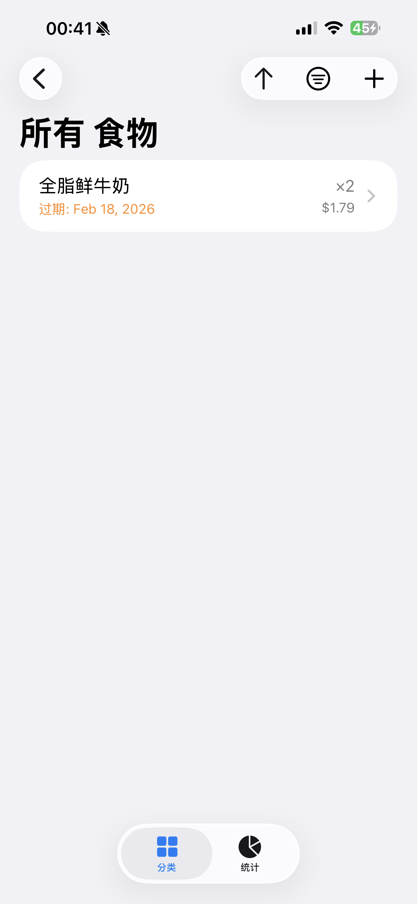
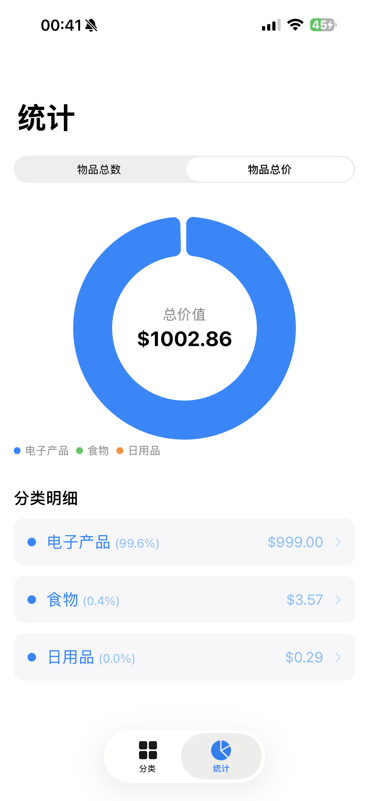

# ItemMaster 📦

[](https://developer.apple.com/swift/)
[](https://www.apple.com/ios/)
[](https://developer.apple.com/xcode/swiftdata/)
[](LICENSE)

**ItemMaster** is a modern, minimalist household inventory management application designed to help you track everything you own. Built entirely with **SwiftUI** and powered by **SwiftData**, it offers a seamless experience for monitoring expiry dates, categorizing supplies, and visualizing your consumption.

## ✨ Features

- [x] **Smart Categorization**: Organise items with a flexible two-level category system.
- [x] **Location Tracking**: Know exactly where your items are (e.g., Kitchen > Top Drawer).
- [x] **Expiry Alerts**: Dynamic sorting highlights items nearing their expiry date.
- [x] **Photo Attachments**: Capture item photos with automatic compression and orientation correction.
- [x] **Visual Analytics**: Beautiful pie charts using **Swift Charts** to visualize quantity and total value.
- [x] **Powerful Search**: Instant search by item name or custom tags.
- [x] **Offline First**: All data is stored locally using SwiftData for maximum privacy and speed.

## 🛠 Tech Stack

- **Framework**: SwiftUI (100%)
- **Data Persistence**: SwiftData
- **Data Visualization**: Swift Charts
- **Media Handling**: PhotosUI & AVFoundation
- **Architecture**: MVVM + Observation framework

## 🚀 Getting Started

### Prerequisites
- Xcode 15.0 or later
- iOS 17.0+ device or simulator (Note: Camera features require a physical device)

### Installation
1. Clone the repository:
   ```bash
   git clone https://github.com/yourusername/ItemMaster.git
   ```
2. Open `ItemMaster.xcodeproj` in Xcode.
3. Ensure your signing team is configured in the project settings.
4. Build and Run it with your iphone connected!

## 📂 Project Structure

```text
ItemMaster/
├── App/            # App entry point & Configuration
├── Models/         # SwiftData Schemas (Item, Category, Tag, etc.)
├── Views/          
│   ├── Home/       # Category lists & Search
│   ├── Item/       # Add, Edit, and Detail screens
│   ├── Dashboard/  # Swift Charts implementation
│   └── Components/ # Reusable UI elements (FlowLayout, CameraPicker)
├── ViewModels/     # Observable logic handlers
├── Services/       # Image storage & Local I/O
└── Utils/          # Constants & Image Processing Helpers
```

## 📸 Screenshots

| Category List | Item Details | Statistics |
| :---: | :---: | :---: |
|  |  |  |

## 🤝 Contributing

Contributions are what make the open source community such an amazing place to learn, inspire, and create. Any contributions you make are **greatly appreciated**.

1. Fork the Project
2. Create your Feature Branch (`git checkout -b feature/AmazingFeature`)
3. Commit your Changes (`git commit -m 'Add some AmazingFeature'`)
4. Push to the Branch (`git pull origin feature/AmazingFeature`)
5. Open a Pull Request

## 📄 License

Distributed under the GNU GPLv3 License. See `LICENSE` for more information.

---
*Created with ❤️ using SwiftUI*
